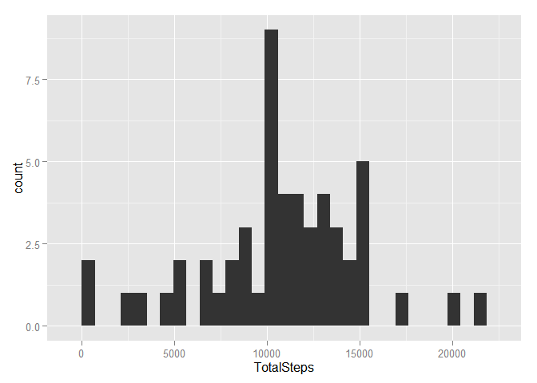
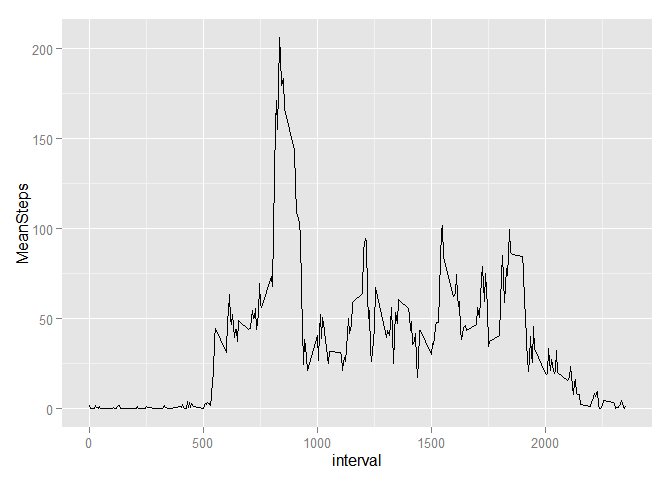
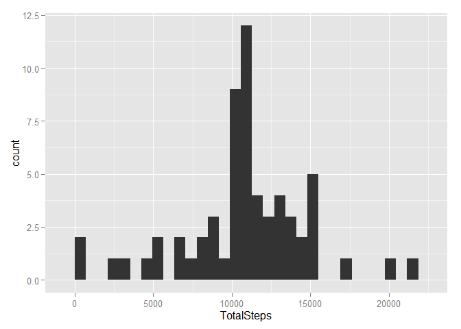
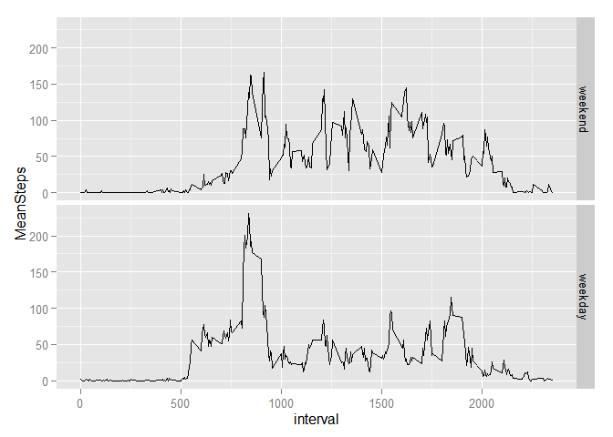

# Peer1
#Loading library

```r
library("dplyr")
```

```
## Warning: package 'dplyr' was built under R version 3.2.2
```

```
## 
## Attaching package: 'dplyr'
## 
## Следующие объекты скрыты от 'package:stats':
## 
##     filter, lag
## 
## Следующие объекты скрыты от 'package:base':
## 
##     intersect, setdiff, setequal, union
```

```r
library("ggplot2")
```

```
## Warning: package 'ggplot2' was built under R version 3.2.2
```

```r
library("lubridate")
```

```
## Warning: package 'lubridate' was built under R version 3.2.2
```

#Loading and preprocessing the data

```r
activity<-read.table("activity.csv", header=TRUE, sep=",", as.is=TRUE)
```

#What is mean total number of steps taken per day?

```r
activity.wo.NA<-dplyr::filter(activity, steps!="NA")
activity.wo.NA %>% dplyr::group_by(date) %>%
  dplyr::summarise(TotalSteps=sum(steps))-> TotalSteps
ggplot2::ggplot(TotalSteps, aes(TotalSteps))+geom_histogram()
```

```
## stat_bin: binwidth defaulted to range/30. Use 'binwidth = x' to adjust this.
```

 

```r
meanSteps.orig<-mean(TotalSteps$TotalSteps)
meanSteps.orig
```

```
## [1] 10766.19
```

```r
medianSteps.orig<-median(TotalSteps$TotalSteps)
medianSteps.orig
```

```
## [1] 10765
```

#What is the average daily activity pattern?

```r
activity.wo.NA %>% group_by(interval) %>% 
  summarise(MeanSteps=mean(steps))-> MeanSteps
ggplot(MeanSteps, aes(interval,MeanSteps))+geom_line()
```

 

```r
MeanSteps[which.max(MeanSteps$MeanSteps),]$interval
```

```
## [1] 835
```

#Imputing missing values

```r
sum(is.na(activity))
```

```
## [1] 2304
```

```r
activity.join<-left_join(activity,MeanSteps)
```

```
## Joining by: "interval"
```

```r
activity.join[is.na(activity.join$steps),1]<-activity.join[is.na(activity.join$steps),4]
activity.impute<-activity.join[,-4]
activity.impute %>% group_by(date) %>% 
  summarise(TotalSteps=sum(steps))-> TotalSteps.impute
ggplot(TotalSteps.impute, aes(TotalSteps))+geom_histogram()
```

```
## stat_bin: binwidth defaulted to range/30. Use 'binwidth = x' to adjust this.
```

 

```r
meanSteps.impute<-mean(TotalSteps.impute$TotalSteps)
meanSteps.impute
```

```
## [1] 10766.19
```

```r
medianSteps.impute<-median(TotalSteps.impute$TotalSteps)
medianSteps.impute
```

```
## [1] 10766.19
```
*Yes, value median  is changed, because impute values changed by median and median grow.*

#Are there differences in activity patterns between weekdays and weekends?

```r
activity.impute$date<-as.Date(activity.impute$date)
activity.impute$wday<-wday(as.Date(activity.impute$date))
activity.impute$dayweek<-factor(activity.impute$wday %in% c(2:6),label=c("weekend", "weekday"))
activity.impute %>% group_by(interval, dayweek) %>% 
  summarise(MeanSteps=mean(steps))-> MeanStepsDayWeek
ggplot(MeanStepsDayWeek, aes(interval,MeanSteps))+geom_line()+facet_grid(dayweek~.)
```

 
